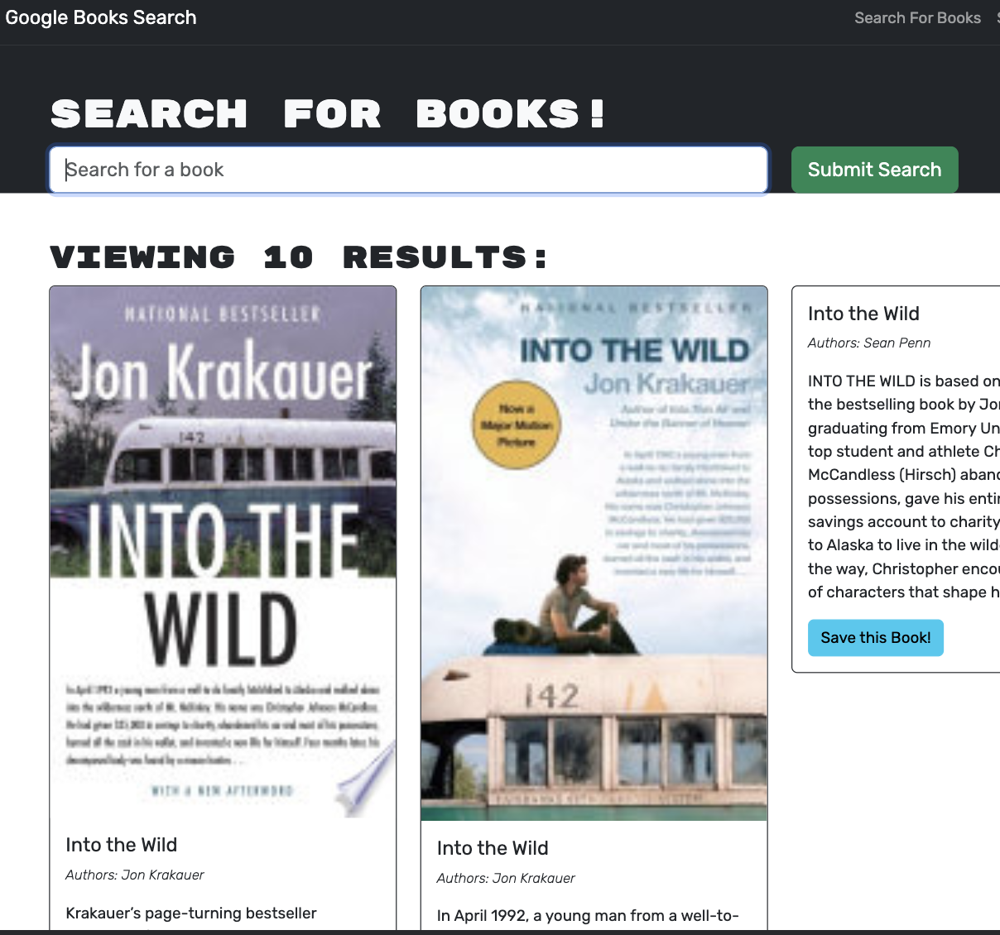

# Book Search Engine - MERN Application 

## Description 

[Application deployed on Heroku](https://search-engine-google-a4763a9a3688.herokuapp.com/saved)

Fully functioning Google Books API search engine that originally used RESTful API and was refactored to work with GraphQL. instead The app was built using the MERN stack, with a React front end, MongoDB database, and Node.js/Express.js server and API.

- The search engine was build with RESTful API and was refactored to work with GraphQL instead
- Set up an Apollo Server to use GraphQL queries and mutations to fetch and modify data, replacing the existing RESTful API.
- Modify the existing authentication middleware so that it works in the context of a GraphQL API.
- Create an Apollo Provider so that requests can communicate with an Apollo Server.
- Deploy the application to Heroku.

## Table of Contents

- [License](#License)
- [Future](#Future)
- [Credits](#Credits)
- [Contact](#Contact)

## License

License: MIT License

## Credits

Jose Escoto, Full Stack Development Student, University of Berkeley.

## Contact

For more questions please contact below:
Email: j.escoto14@gmail.com
GitHub: [escotoj](https://github.com/escotoj)

